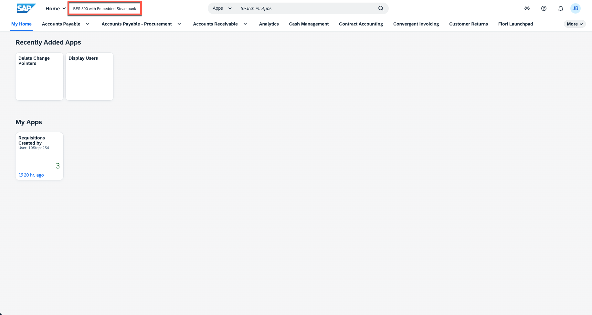

# Create an SAP Fiori Launchpad Custom Plugin with SAP Business Application Studio and SAP S/4HANA Embedded Steampunk

## Description

This repository contains the material for creating a custom SAP Fiori Launchpad plugin with SAP Business Application Studio along with instructions on how to use Embedded Steampunk in SAP S/4HANA 2022 or higher to create custom developer extensibility services for consumption in this custom Fiori Launchpad Plugin.  

## Overview

In this section we will describe the main activities to be run for creating a custom Fiori Launchpad Plugin that consumes a custom service in Embedded Steampunk in SAP S/4HANA 2022 or higher.

The objective of creating this custom Fiori Launchpad plugin is for your end-users to be able to quickly distinguish which system and client they have logon to in the system. The information will be displayed in the SAP Fiori Launchpad header title section and through this custom Fiori plugin the user will see the System ID along with client number information as shown in the image.

## Prerequisites

You need to ensure the fulfillment of all of the following points for you to successfully run this exercise:

* You have installed the _latest_ ABAP Development Tools (ADT), see [ABAP Development Tools](https://tools.hana.ondemand.com/#abap).
* You have an SAP S/4HANA 2022 system deployed in an on-premise Sandbox or via SAP Cloud Application Library (CAL).
* You have fully configured SAP Fiori and have developer access to the backend system where embedded SAP Fiori is deployed.
* You have fully setup Cloud Connector and created a destination to your backend S/4HANA system.
* You have fully setup SAP Business application Studio including the setup of Development Spaces.
* You have access to creation+read access of transport requests in your SAP Backend system for both customizing and workbench requests.

## Exercises

Follow these steps to build a custom SAP Fiori Launchpad Plugin consuming Embedded Steampunk Services.
- [Understanding SAP S/4HANA Embedded Steampunk](exercises/ex_0/)
- [Exercise 1 - Setting up Embedded Steampunk](exercises/ex_1/)
- [Exercise 2 - Creating a backend function module to expose system details](exercises/ex_2/)
- [Exercise 3 - Creating an HTTP Service](exercises/ex_3/)
- [Exercise 4 - Creating and Deploying a Fiori Launchpad Plugin in SAP Business Application Studio](exercises/ex_4/)
- [Exercise 5 - Activating Plug-in on the on-premise ABAP Platform](exercises/ex_5/)
- [Exercise 6 - Testing your Custom Fiori Launchpad Plugin](exercises/ex_6/)

## Known Issues
No known issues.

## How to obtain support
[Create an issue](https://github.com/SAP-samples/<repository-name>/issues) in this repository if you find a bug or have questions about the content.

For additional support, [ask a question in SAP Community](https://answers.sap.com/questions/ask.html).

## Contributing
If you wish to contribute code, offer fixes or improvements, please send a pull request. Due to legal reasons, contributors will be asked to accept a DCO when they create the first pull request to this project. This happens in an automated fashion during the submission process. SAP uses [the standard DCO text of the Linux Foundation](https://developercertificate.org/).

## License
Copyright (c) 2023 SAP SE or an SAP affiliate company. All rights reserved. This project is licensed under the Apache Software License, version 2.0 except as noted otherwise in the [LICENSE](LICENSE) file.
