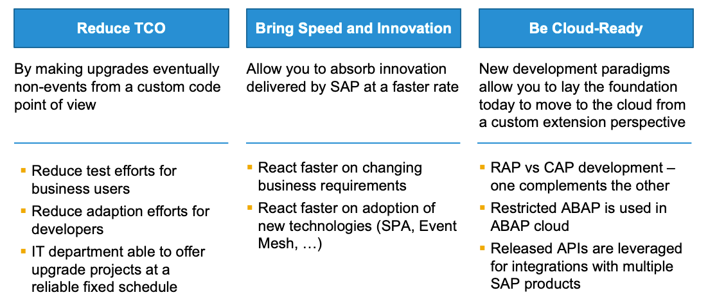
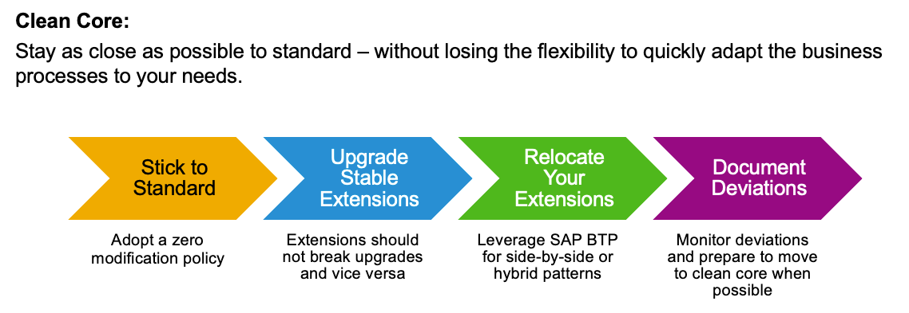
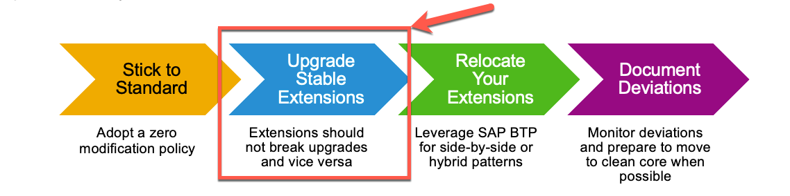

<!--
SPDX-FileCopyrightText: 2023 Jorge Baltazar <jorge.baltazar@sap.com>

SPDX-License-Identifier: Apache-2.0
-->

# UNDERSTANDING SAP S/4HANA EMBEDDED STEAMPUNK

## Introduction
Embedded Steampunk is a new feature included in SAP S/4HANA on-premise from versión 2022 or higher. With this tool you will find new extensibility options called "developer extensibility" which aim to help you ease development of extension in the ABAP platform following a cloud like development approach in a service oriented architecture.

Yes, this means you will build web services but it does not mean all of it will be OData as you will find Embedded Steampunk / Developer extensibility supports other communication protocols.

## Embedded Steampunk and the Clean Core
In the context of an SAP S/4HANA implementation you need to remember that one of the reasons behind this implementation model is to have SAP S/4HANA become an enabler for moving your architecture, business processes and custom code to a cloud like, service oriented model. Meaning that on the long run, you would like your SAP S/4HANA system behave as similar as possible to an SAP S/4HANA Public Cloud system.

To achieve this status you may slowly and incrementally apply the new extensibility approaches according to your needs and adoption feasibility.

This will, in turn:
- Help you reduce your TCO by, for example, reducing test and adoption efforts during a system upgrade.
- It will also allow you to innovate faster and react faster on your business requirements as you can easily adopt new technologies through a service oriented model.
- And it will also allow you to become "cloud ready" as you will be laying out the foundation for you to move to cloud oriented consumption models where, for example, you could implement development models like RAP, also know as ABAP RESTful Application Programming Model or CAP, which stands for SAP Cloud Application Programming Model

  

**But how does this relate to the clean core?**

We can define clean core as an approach to stay as close as possible to the SAP standard models while still having flexibility to adapt business processes to your needs at a fast rate.

There's overall four steps in this journey to achieving a clean core:

1. First, trying to stick to the SAP standard, by for example, defining a zero modification policy in your business.
2. Second, wherever modifications are needed, prefer developing upgrade stable extensions, you can achieve this by, for example, extending SAP Fiori or SAP GUI screens via the extension points available in app Custom Fields and Logic. This helps you tremendously in your custom code lifecycle management as if done correctly, you would need minimum or no code remediations after system upgrades.
3. Third, if previous options are not possible, you may also consider relocating your extensions, meaning, for example, moving your custom code to SAP BTP services like SAP BTP, ABAP Environment and maintaining the lifecycle of these objects on a separate system and landscape.
4. Fourth, if you find out there are no options for you to "clean your core" you can simply document these deviations and prepare to move when new extensibility options become available to your specific use cases.

  

With the steps of the journey outlined I'd like to provide some clarity on this approach as yes, it is true, not all of your custom code would be a candidate for "clean-core" and yes this is not a "quick" activity as it requires code and architecture analysis and time for you to take the best decisions to optimize your custom code lifecycle management, which is the main objective of the "clean-core" concept.

Additionally, it is not mandatory for all of your custom code to go through all the steps, you can have scenarios where only one of the steps or a combination is valid.

## Where does this exercise fit and how would it work?
For this exercise you will be building three main objects on three different layers that would interact between them to provide a clean core solution.

  

1. You will start by creating an upgrade stable object. In this case through a custom function module based only on standard function modules and BAPIs to provide the required information from the system. This custom function module would act as a wrapper for standard objects.
2. You custom function module will then be consumed by a custom HTTP Service. This service will contain a small footprint easing the maintenance effort and will be created on top of the Embedded Steampunk "engine" meaning at this layer you will be using cloud-like ABAP code which is also upgrade stable and even gives you options at a later point to decouple the code in this layer and relocate to other solutions like SAP ABAP Cloud Environment on BTP.
3. A custom Fiori Plugin created on SAP Business Application Studio. In this object you will implement custom code to call the custom HTTP service, manipulate data from the response (if needed) and publish information in the SAP Fiori Launchpad. Important to note is that Fiori Launchpad Plugins load asynchronously so you will face a challenge to define at what moment should the plugin should be rendered in the Fiori Launchpad without affecting other features in this layer.

Based on the concepts above, we would then identify that our exercise would fit in the second option in the clean core journey

  

## Is this all there is to know about Embedded Steampunk?
Fortunately not, but for the scope of this exercise we will limit to the concepts described above through a hands-on approach.

Note that using Embedded Steampunk you can create a variety of services like:
1. External Services:
    - HTTP
    - RFC
    - SOAP
2. APIs
    - HTTP
    - RFC
3. Services for consumption of ABAP Managed Data via ODBC-Based Clients
4. Analytical Models / Live Data Connections

For more information on Embedded Steampunk and possible use cases we strongly recommend reviewing the contents in the [SAP Help Documentation of the ABAP platform ](https://help.sap.com/docs/ABAP_PLATFORM_NEW/b5670aaaa2364a29935f40b16499972d/155909e3569941e08831c78cf4c2d495.html).

To continue with this exercise go to [Exercise 1](../ex_1)

## License
Copyright (c) 2023 SAP SE or an SAP affiliate company. All rights reserved. This project is licensed under the Apache Software License, version 2.0 except as noted otherwise in the [LICENSE](../../LICENSES/Apache-2.0.txt) file.
