<!--
SPDX-FileCopyrightText: 2023 Jorge Baltazar <jorge.baltazar@sap.com>

SPDX-License-Identifier: Apache-2.0
-->

# CREATING AN HTTP SERVICE

## Introduction
In this section you will find the steps to create an HTTP Service in Embedded Steampunk which you cal later call from your browser

## Create a custom HTTP Service in Embedded Steampunk
To create this custom HTTP Service, you would need to work in the Embedded Steampunk development package you created earlier as part of [Exercise 1](../ex_1#create-a-custom-development-package-for-your-embedded-steampunk-custom-developments).

42. In **Project Explorer**, right-click on the ABAP Package **"ZCUSTOM_OBJECTS4STMPNK"**. From the menu, select **New >> Other ABAP Repository Object**.

  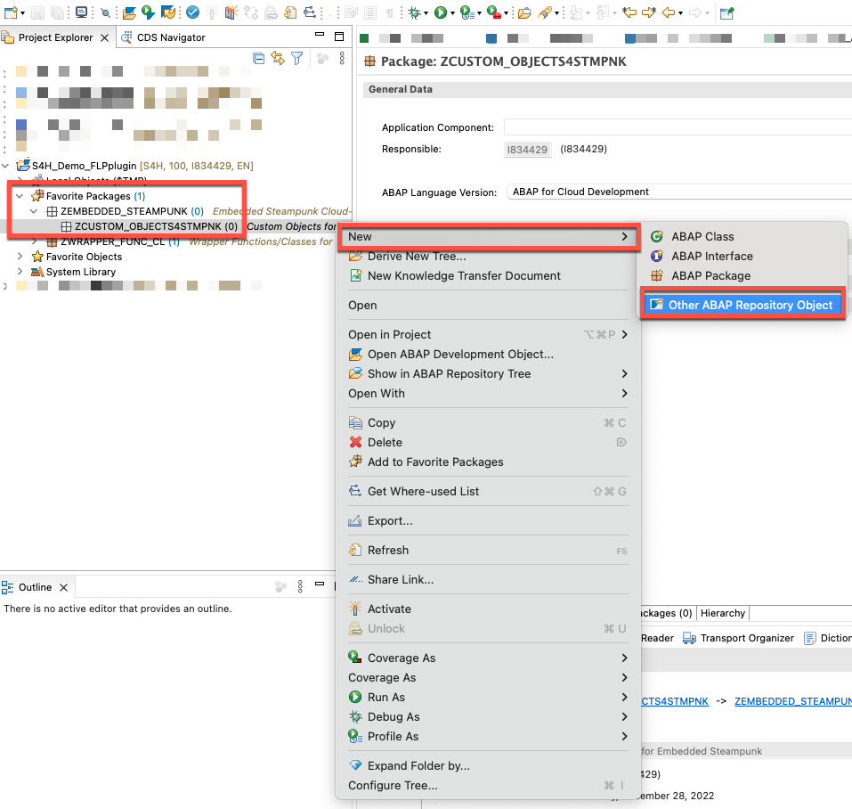

43. In the dialog window, search for keyword: "Service". Once results are displayed, select entry **HTTP Service** and click **Next**.

  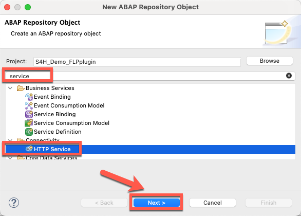

44. Enter the following information and click **Next**:
  * Name: **<< Your custom HTTP service name >>** (for example: ZGET_SYSTEM_DETAILS).
  * Description: **<< Your custom HTTP service  description >>** (for example: GET Backend System Details).
  * Add to favorite packages: **Inactive**

  **NOTE** - The value in parameter **Handler Class** will be updated automatically, do not modify this value.

  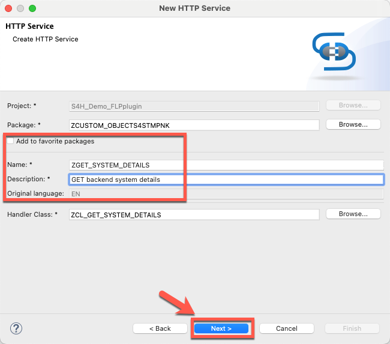

45. Select an existing transport request or create a new one to save your changes and click **Finish**

  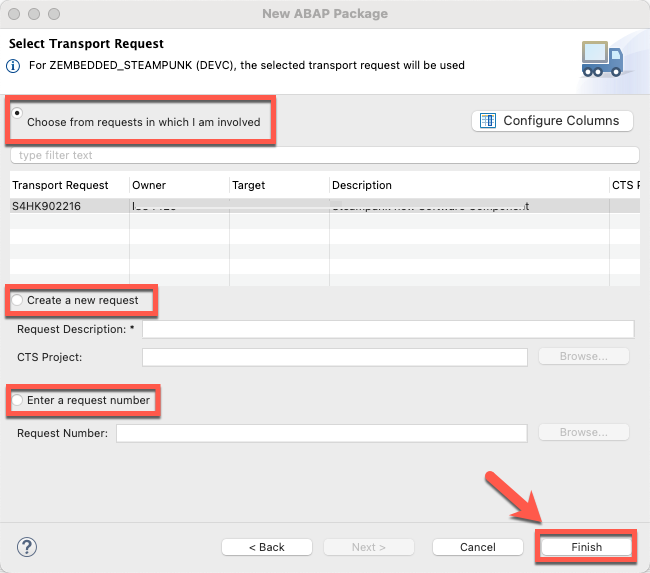

46. On successful creation you will notice two objects have been generated: an HTTP service and a Handler Class. Navigate to the Handler Class by clicking on text "Handler Class".

  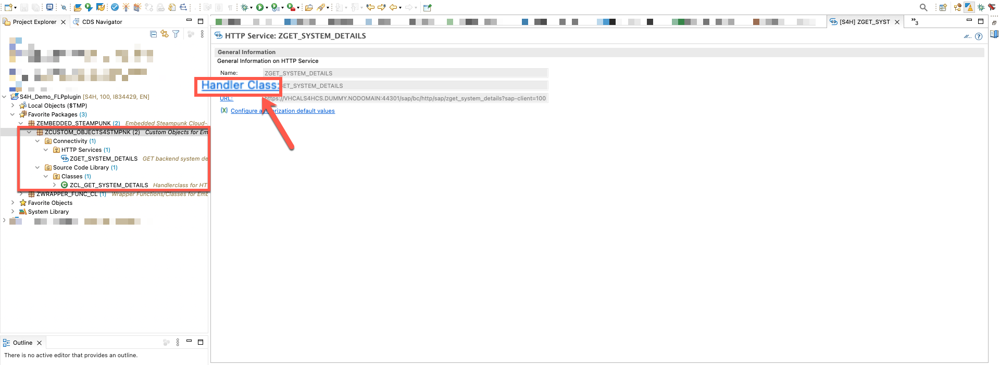

47. Copy the code from our [sample](sources/ZCL_GET_SYSTEM_DETAILS.abap) into this handler class. **Save** and **Activate**.

  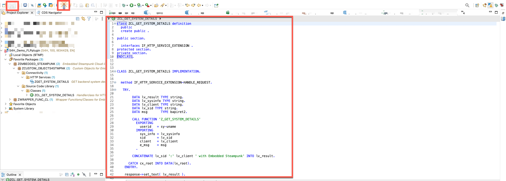

48. When trying to activate a critical error will be displayed which would not allow you to activate this object.

  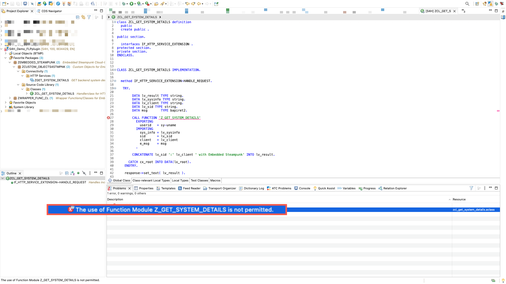

  **NOTE** - The error is generated because the most important step to consume the backend wrapper is missing. In the next section you will find how to add a Release Contract to the backend wrapper function module. Be aware that when coding in Embedded Steampunk, you may only consume "cloud-released" objects.

## Adding a Release Contact
As mentioned above, when coding in Embedded Steampunk, you may only consume "cloud-released" objects. In this section we will explain how to add a Release Contract to our wrapper function module.

49. Using **PRoject Explorer**, navigate to and open Function Module "Z_GET_SYSTEM_DETAILS". Once the function module is displayed, go to **Properties** view in ADT

  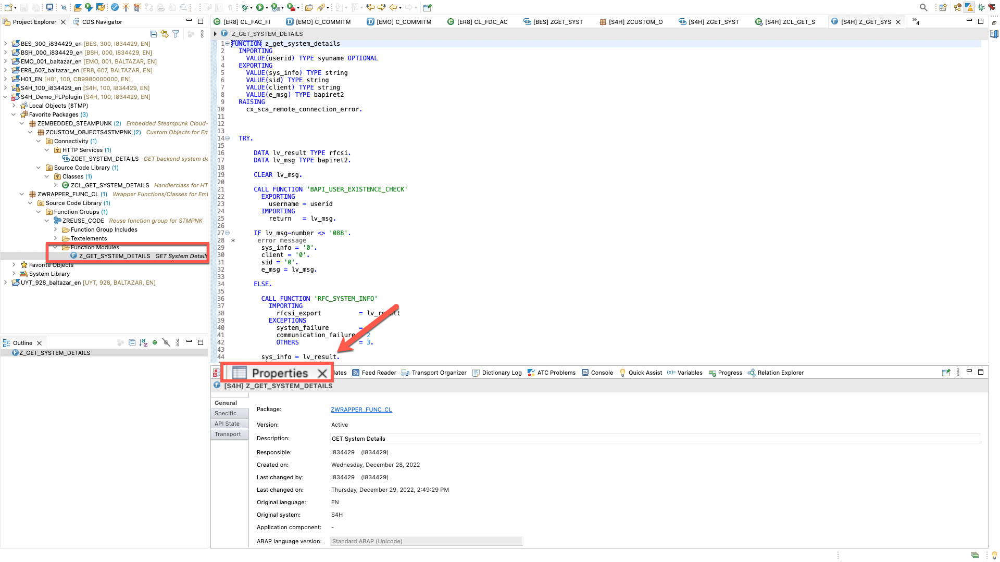

  **NOTE** - If you cannot find the **Properties** view, navigate to **Window >> Show View >> Properties**.

  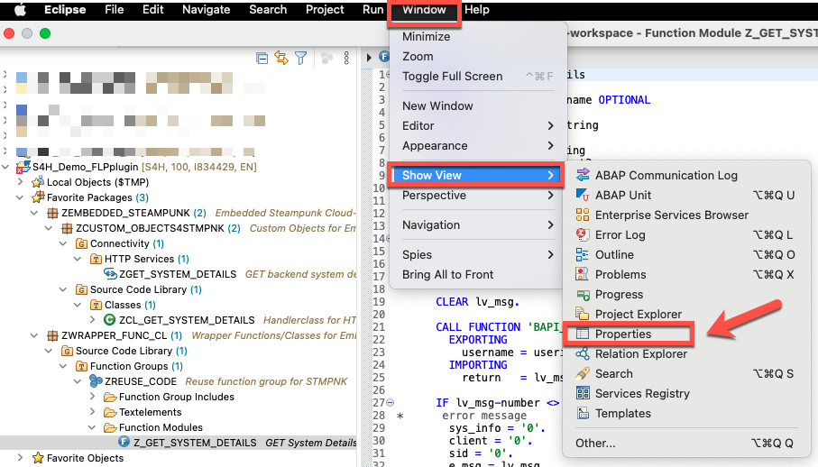

50. In **Properties** view, switch to **API State** tab and click on **Add Release Contract**

  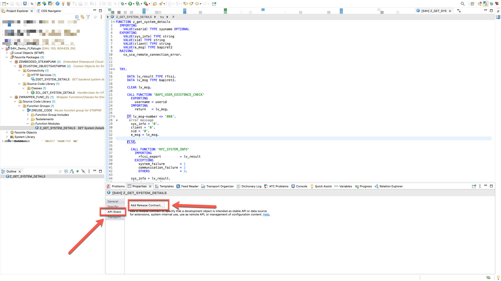

51. In the dialog screen, use the default provided values and click on **Next**
  * Release State: **Released**
  * Visibility: **Use in Cloud Development**

  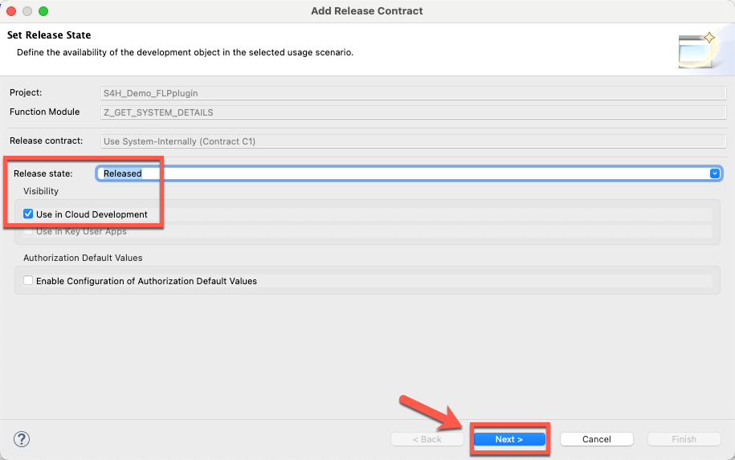

52. No conflicts should be identified, click on **Next**.

  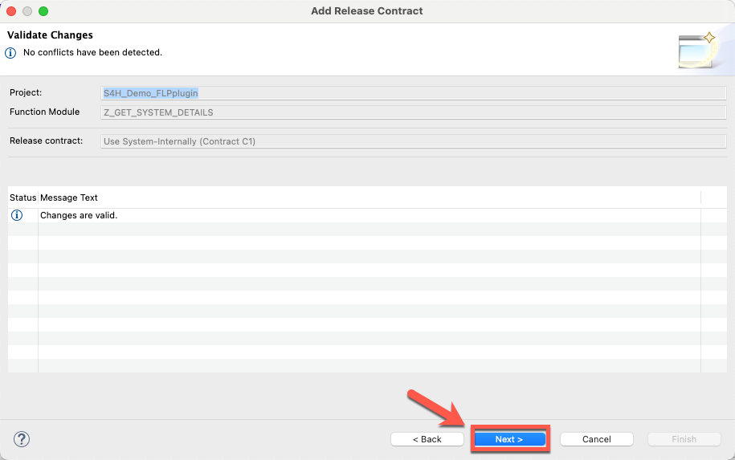

53. Select an existing transport request or create a new one to save your changes and click **Finish**

  

54. Once successfully saved, you should notice Release Contract **C1** has been assigned to function module "Z_GET_SYSTEM_DETAILS".

  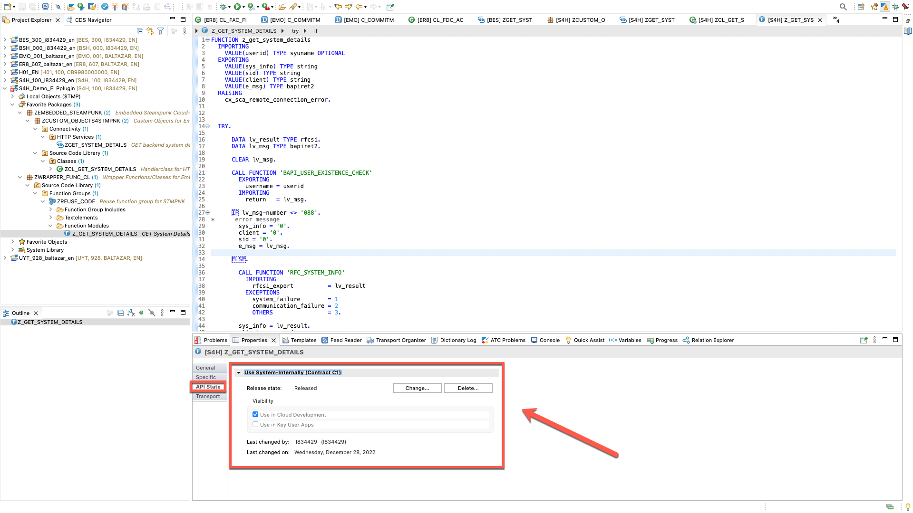

55. Go back to handler class "ZCL_GET_SYSTEM_DETAILS" and **Activate**, activation should be successful.

  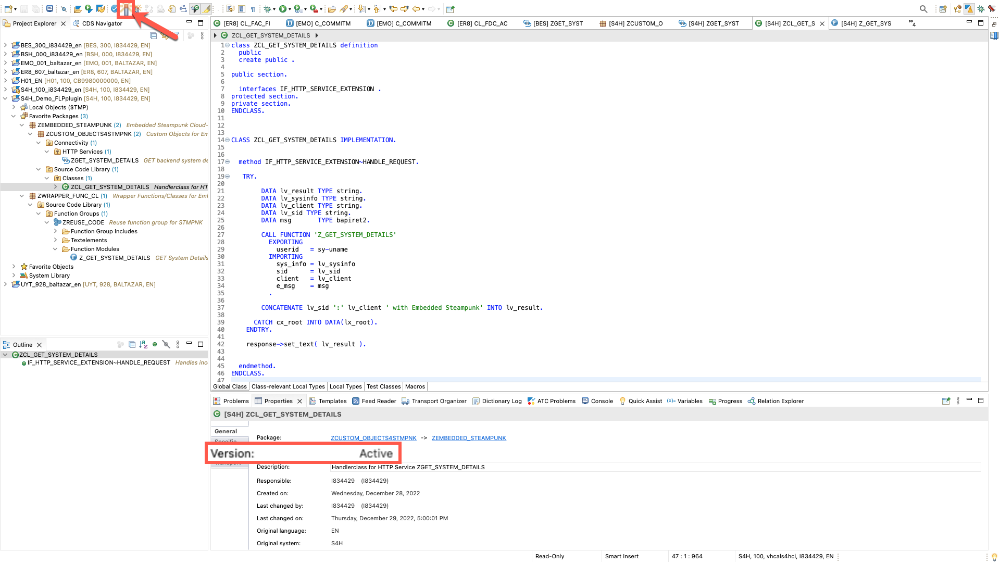

56. Open SAP GUI transaction **/nUCON_HTTP_SERVICES**.

  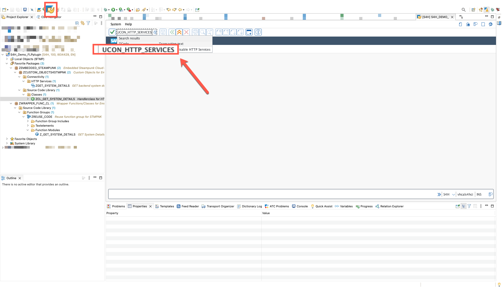

57. Click on Search button and scroll to your service (ZGET_SYSTEM_DETAILS).

  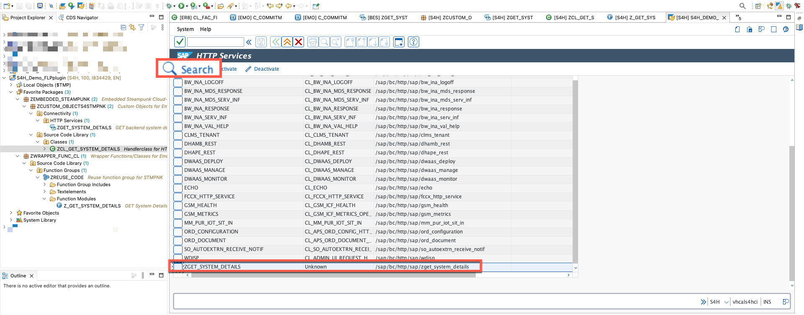

58. Select your service (ZGET_SYSTEM_DETAILS) and click on **Activate**

  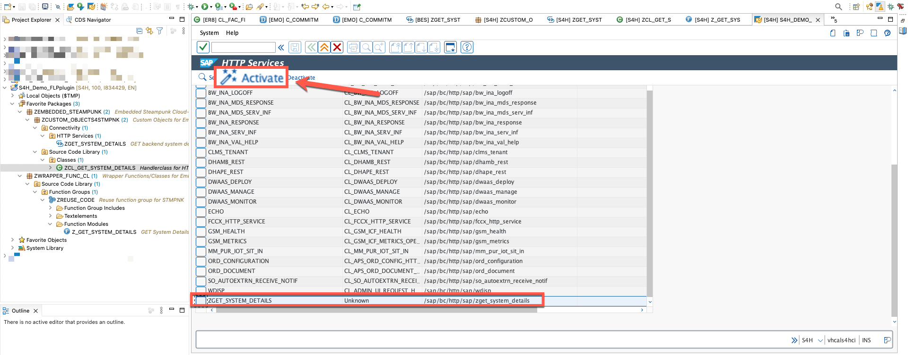

  **NOTE** - These last steps are required to activate your custom HTTP service as simply activating the code is not enough for activating an HTTP service.

## What does this code do?
In this section we will briefly explain what the copied code is doing.

  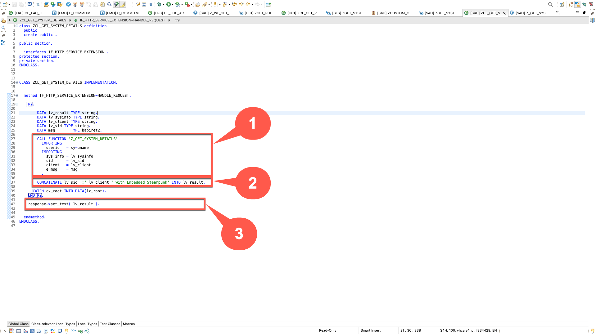

59.1 In this part of the code we are calling the "cloud-enabled" function module **Z_GET_SYSTEM_DETAILS**

59.2 In this section we are concatenating the values of System Id, Client and some additional texts into a single string which will be shown as the output from this service call.

59.3 In this section we return the concatenated string as the body of the HTML response.

## Test the code
In this section we will briefly explain how to test the code.

60. To test the code, click on the **URL** text. The service will be opened in your desktop's browser and you should see the string containing text with System ID and Client number

  **NOTE** - You will be prompted for authentication (basic or SAML depending on your system settings).

  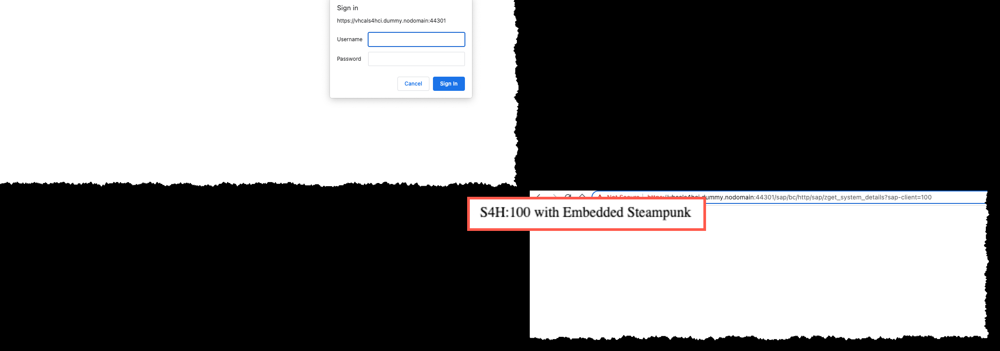

  **NOTE** - To debug your code, you can add breakpoints anywhere in your handler class (ZCL_GET_SYSTEM_DETAILS)

  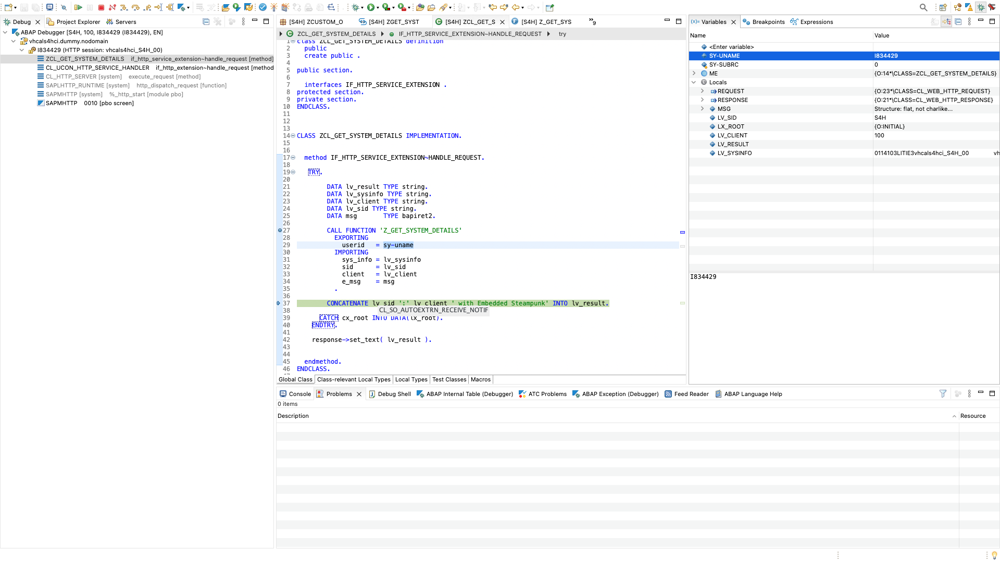

## Next Steps
In the next section you will create the second object in our custom development architecture: **a Custom Fiori Launchpad Service (number 3 in the diagram)**.

  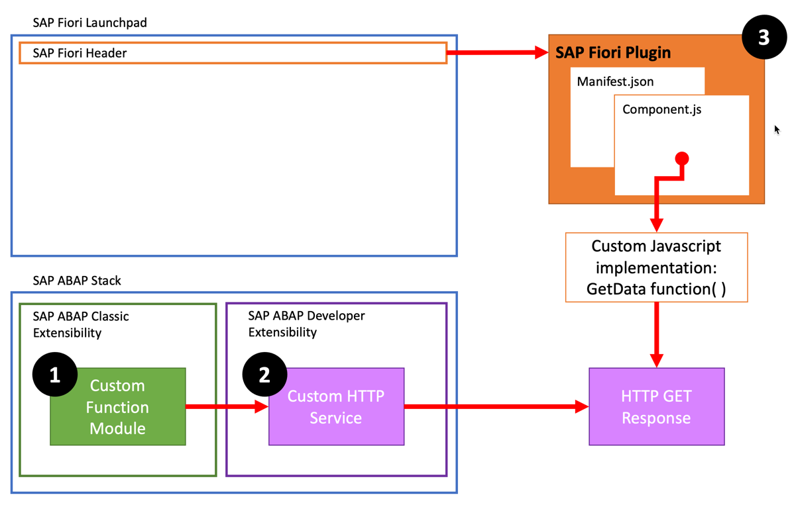

To continue with this exercise go to [Exercise 4](../ex_4)

## License
Copyright (c) 2023 SAP SE or an SAP affiliate company. All rights reserved. This project is licensed under the Apache Software License, version 2.0 except as noted otherwise in the [LICENSE](LICENSE) file.
