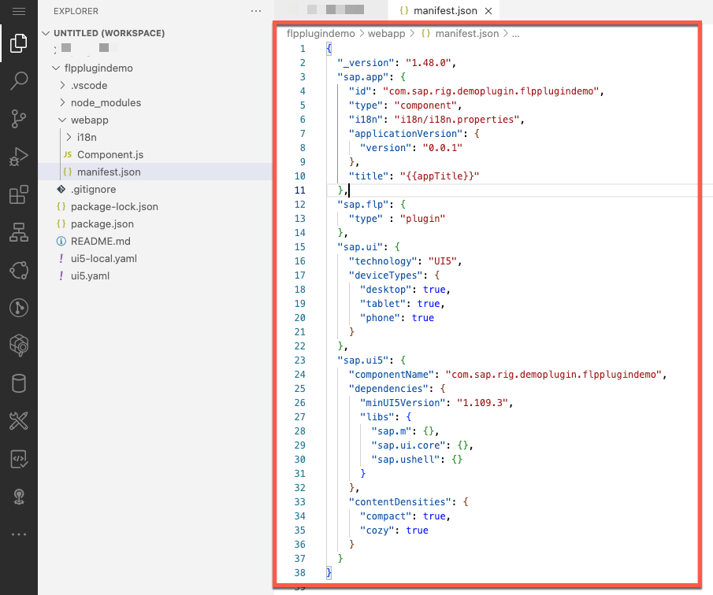
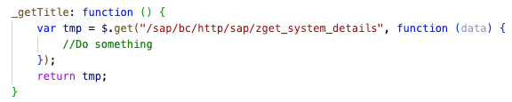
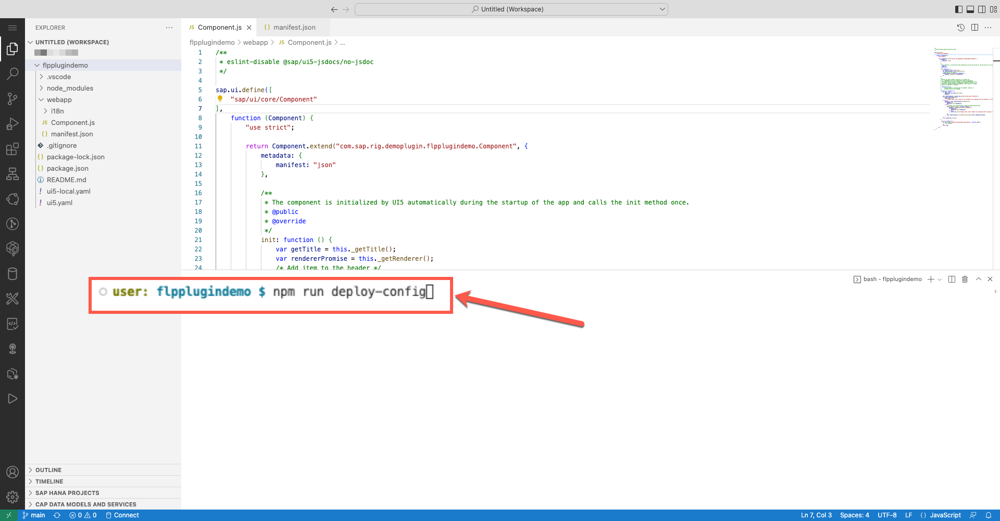
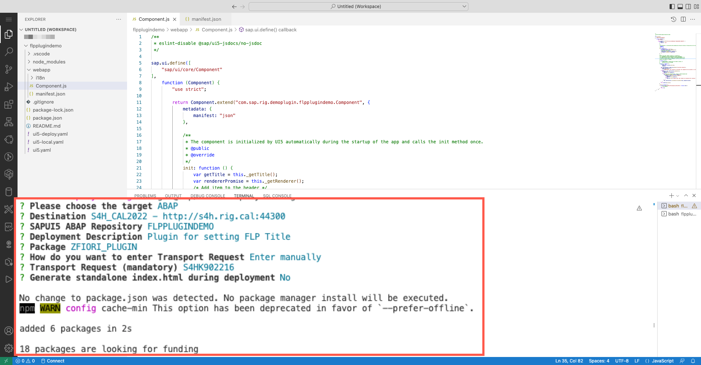

<!--
SPDX-FileCopyrightText: 2023 Jorge Baltazar <jorge.baltazar@sap.com>

SPDX-License-Identifier: Apache-2.0
-->

# CREATING AND DEPLOYING AN SAP FIORI LAUNCHPAD PLUGIN IN SAP BUSINESS APPLICATION STUDIO

## Introduction
In this section you will find the required steps to create a new SAP Fiori Launchpad Plugin project in SAP Business Application Studio.

## Create a new backend package for Plugin Development
Create a new development package with the following details:
* Name: **<< Your plugin package name >>** (for example: ZFIORI_PLUGIN).
* Description: **<< Your plugin package description >>** (for example: Package for Fiori Plugins).
* Add to favorite packages: **Active**
* Superpackage: **Blank**
* Package Type: **Development**
* Software Component: **HOME**

  

## Create a new BAS project
You should start by creating a new BAS project using the standard project generators for a freestyle application. To do this follow the next steps:

61. Launch BAS. Once loaded, go to **File >> New Project from Template**.

  

62. Select **SAP Fiori Application** generator and click on **Start**

  

63. Select **SAPUI5 freestyle** from **application type** dropdown, followed by selecting the **SAPUI5 Application** generator and clicking on **Next**.

  

64. Select **Data source = None** and click on **Next**.

  

65. Use default value for field **View name** and click on **Next**.

  

66. Enter the following details and click on **Finish**:

| **Parameter**                 | **Value**                                                                        |
|-------------------------------|------------------------------------------------------------------------------|
| Module Name:                  | **< Your plugin module name >** (for example: **flpplugindemo**)               |
| Application Title:            | **< Your plugin title >** (for example: **FLPplugin demo**)                    |
| Application Namespace:        | **< Your plugin namespace >** (for example: **com.sap.rig.demoplugin**)        |
| Description:                  | **< Your plugin description >** (for example: **A Fiori plugin**)              |
| Project folder path:          | **< Your project root folder in BAS >** (for example: **/home/user/projects**) |
| Minimum SAPUI5 version:       | **< Your backend system SAPUI5 library version >** (for example: **1.109.3**)  |
| Add deployment Configuration: | **No**                                                                       |
| Add FLP configuration         | **No**                                                                       |
| Configure advanced options    | **No**                                                                       |

  

67. Once the project is generated you should find a new folder in your workspace containing the folder structure of the project.

  

## Adapt Generated Project
The generated project is created as a freestyle application, meaning it is considering navigation routers, controllers and views to be displayed as an SAP Fiori app. Unfortunately, in our case we need to create an SAP Fiori Launchpad Plugin, which is the simplest form of an app and is actually called a **Component**.

Follow the next steps to adjust the current project structure to behave as an SAP Fiori Component.

68. You will need to delete the following folders and their contents by right clicking on the folder and selecting **Delete Permanently** from the menu.

| Folder to delete |
|------------------|
| controller       |
| css              |
| model            |
| test             |
| utils            |
| view             |

  

69. Once all mentioned folders are deleted, you should also delete the **index.html** file.

  

70. With all files and folder deleted, your project should only contain the i18n folder, component.js and manifest.json files.

  

**NOTE** - As we have modified the project structure and deleted test files, you will not be able to test the plugin from BAS, you would need to deploy the plugin to the on-premise system for testing. Plugin deployment is explained in the following sections.

## Adapt Component.js and Manifest.json files
In this section you will modify the manifest.json and component.js files to setup the SAP Fiori Launchpad plugin and include business logic to make a call to your custom HTTP service (created in [Exercise 3](../ex_3)).

71. Open the manifest.json file in your project and take note of the value of the **ID** parameter.

  

72. Copy the code from the [sample manifest.json](sources/manifest.json) file into your code.

  

  **NOTE** - Plugins do not require additional definitions, this would be the simplest version of a manifest.json file and the base for creating an FLP plugin.

73. Edit the values of parameters **ID** and **componentName** with the value you identified on **Step 71**.

  

74. Open the Component.js file in your project and take note of the value of the **Full Component Name** from the **return UIComponent.extend** statement.

  

75. Copy the code from the [sample Component.js](sources/Component.js) file into your code.

  

  **NOTE** - We will explain what the code is doing in the following section.

76. Edit the values of your **Full Component Name** in the **return Component.extend** statement with the value you identified on **Step 74**.

  

## What does this code do?
In this section we will briefly explain what the copied code is doing.

### * Manifest.json
In the [manifest.json](sources/manifest.json) file, we define the app type and additional dependencies of the plugin:

  

77.1 In this section we provide the basic definition of the plugin with information like version, component ID and title. Note that the most important parameter is **type** as here we define the object as a **component**, instead of an application also important is to identify that all other parameters from the application generator template inserted while running the generator have been removed as they are not needed by the plugin.

77.2 This is a new section that must be added manually each time you create a new plugin. With this section you let the SAP Fiori Launchpad understand that the code from this project will be a plugin.

77.3 These are summarized versions of the **sap.ui** and **sap.ui5** collections, in here we add the parameters needed by the plugin, all other parameters are removed as they are only useful for **applications**. Note that parameter **componentName** should match with parameter **id** from section 1.

### * Component.js
In the [Component.js](sources/Component.js) file we add the code to decide when the plugin will and if it should be rendered and make the call to the HTTP service to the response from this web call into the SAP Fiori Launchpad header title.

#### - Init function()
  

78. In this section we are initializaing the plugin, at this moment the code will first call the backend service through the **_getTitle function** followed by retrieving an instance of the FLP header through the **_getRenderer function**. Once the renderer becomes available, we set the response text from our backend service as a title through the **setHeaderTitle method** of the rendered instance (at this moment the rendered instance is the FLP header).

#### - _getTitle function()
  

79. In the **_getTitle function** we run a call to the backend custom HTTP service in Steampunk. We run this call using **jQuery GET** function with a **relative URL** (as we have an embedded deployment of SAP Fiori). If needed, we could make some additional processing of the data in the response or add extra functions to handle call service failure. For the purpose of this exercise we will not provide such implementations.

#### - _getRenderer function()
  

80. The **_getRenderer function** is a generic renderer implementation you can use in any of your custom plugin developments. In this function we identify when the plugin is rendered and once rendered we use the functions in the object (like **setHeaderTitle method**). This implementation is needed as you need to call your functions once the plugin is rendered (which is an unknown variable at runtime) otherwise your code would run as part of the main Fiori Launchpad shell initialization, causing **not found** errors.

## Deploy your Plugin to your SAP S/4HANA backend system.
Once you have adjusted the code you would need to deploy your code to test the plugin, **note** that for the deployment to work you must have already setup your SAP Cloud Connector and Destinations in SAP BTP, we will not cover these in this exercise.

You will find the instructions on how to do the deployment in the following steps:

81. Right-click on your project name (for example: **flpplpugindemo**) and from the menu, select option **Open in Integrated Terminal**.

  

82. From the terminal, run command **npm run deploy-config**

  

83. Select **Target : ABAP**

  **NOTE** - Use arrow keys to select entries and press **Enter**

  

84. Select your **backend destination** and press **Enter**.

  

85. Define a name for the ICF node that will be created on deployment (for example: **ZFLPplugindemo**) and press **Enter**.

  

86. Enter a description to your ICF node (for example: **Plugin for setting FLP Title**) and press **Enter**.

  

87. Enter the name of the plugin package you created earlier (for example: **ZFIORI_PLUGIN**) and press **Enter**.

  

88. Enter a transport request (manually, choose from existing or create a new transport request)

  

89. Enter **No** and press **Enter**.

  

90. Wait for the process to conclude.

  

91. From the terminal, run command **npm run build** and wait for the process to conclude.

  

92. From the terminal, run command **npm run deploy**, review your deployment setting and enter **YES** to continue (press **Enter**).

  

93. Wait for the process to conclude.

  

94. You can confirm correct deployment by checking the existence of the ICF node in transaction **SICF** or by checking the contents of your custom plugin development packages

  

## Next Steps
In the next section you will activate your custom SAP Fiori Launchpad Plugin on your ABAP platform.

To continue with this exercise go to [Exercise 5](../ex_5)

## License
Copyright (c) 2023 SAP SE or an SAP affiliate company. All rights reserved. This project is licensed under the Apache Software License, version 2.0 except as noted otherwise in the [LICENSE](../../LICENSES/Apache-2.0.txt) file.
