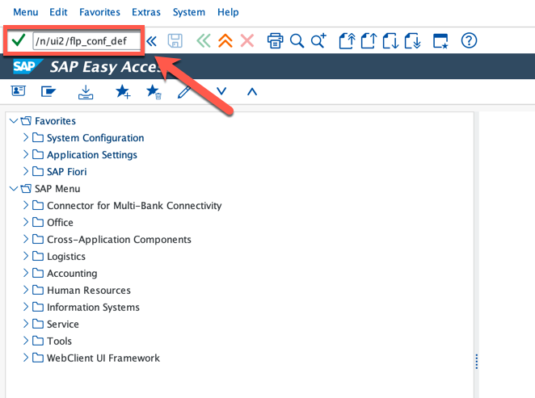
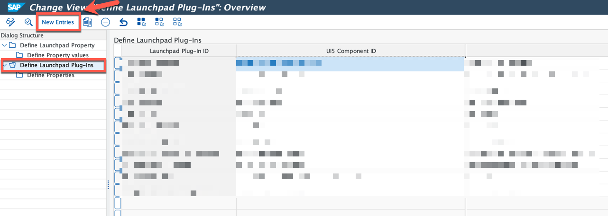
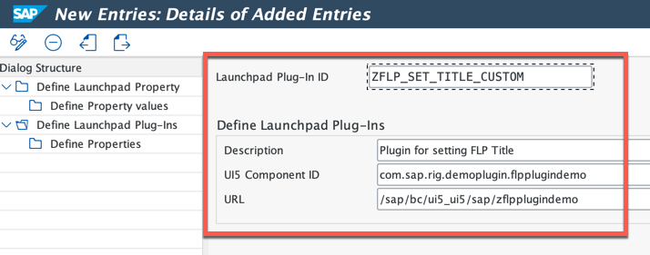
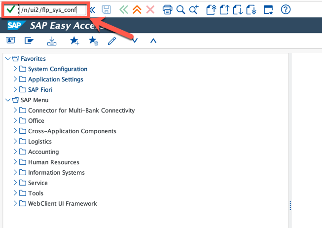
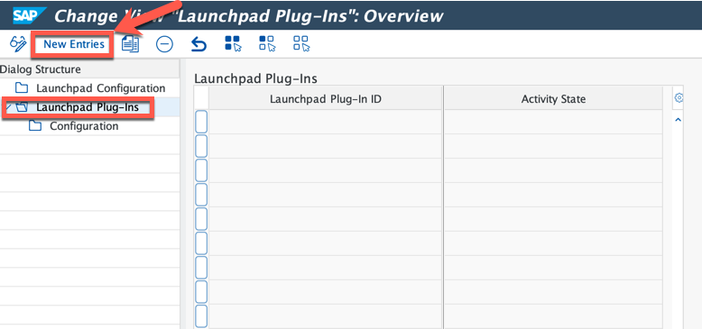
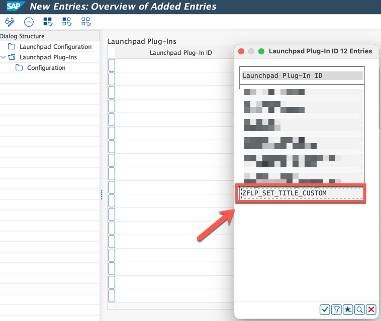

<!--
SPDX-FileCopyrightText: 2023 Jorge Baltazar <jorge.baltazar@sap.com>

SPDX-License-Identifier: Apache-2.0
-->

# ACTIVATING YOUR PLUGIN ON THE ON-PREMISE ABAP PLATFORM

## Introduction
In this section you will find the required steps to activate your custom plugin in your on-premise ABAP Platform, once deployment of SAP Business Application Project is successful.

## Setup plugin configuration
You will now activate your SAP Fiori Launchpad Plugin using the newest tools. To do this follow the next steps:

95. Login to your system in GUI or WebGUI through FLP and run transaction: **/n/ui2/flp_conf_def**.

  

96. Accept all dialog messages, double-click on section **Define Launchpad Plug-ins** followed by clicking on button **New Entries**

  

97. Enter the following details and **Save** (you will be prompted for a transport request):

| Parameter            | Value                                                                                                                |
|----------------------|----------------------------------------------------------------------------------------------------------------------|
| Launchpad Plug-in ID | **< A custom ID to identify your plugin configuration >** (for example: **ZFLP_SET_TITLE_CUSTOM**)                  |
| Description          | **< A description of your plugin >** (for example: **Plugin for setting FLP Title**)                                 |
| UI5 Component ID     | **< The ID from parameter ID in Manifest.json >** (for example: **com.sap.rig.demoplugin.flpplugindemo**)            |
| URL                  | **< The relative URL to the ICF node created on deployment >** (for example: **/sap/bc/ui5_ui5/sap/zflpplugindemo**) |

  

98. Run transaction: **/n/ui2/flp_sys_conf**.

  

99. Accept all dialog messages, double-click on section ** Launchpad Plug-ins** followed by clicking on button **New Entries**

  

100. From the dropdown in field **Launchpad Plug-in ID** select your recently created plugin configuration and **Save** (you will be prompted for a transport request).

  

## Next Steps
In the next section you will test your custom plugin and all the objects in our custom development architecture working together.

  

To continue with this exercise go to [Exercise 6](../ex_6)

## License
Copyright (c) 2023 SAP SE or an SAP affiliate company. All rights reserved. This project is licensed under the Apache Software License, version 2.0 except as noted otherwise in the [LICENSE](../../LICENSES/Apache-2.0.txt) file.
