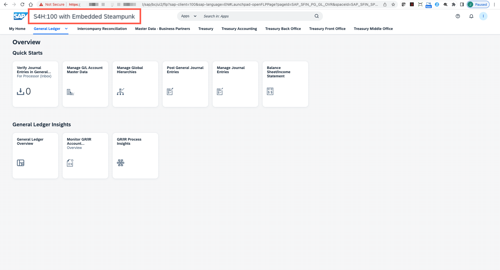

<!--
SPDX-FileCopyrightText: 2023 Jorge Baltazar <jorge.baltazar@sap.com>

SPDX-License-Identifier: Apache-2.0
-->

# TESTING YOUR CUSTOM FIORI LAUNCHPAD PLUGIN

## Introduction
In this section you will find the steps to test your custom Launchpad plugin.

## Test your plugin
You should start by creating a new ABAP project for your SAP S/4HANA 2022 system. To do this follow the next steps:

101. Open your Fiori Launchpad by running transaction **/n/ui2/flp** from GUI/WebGUI or by navigating directly to the Fiori Launchpad URL (for example: **https://< Your system FQDN >:< Your system port >/sap/bc/ui2/flp**).

  As the launchpad loads, you will find the text in the SAP Fiori Launchpad Header title.

  

## Next Steps
You have concluded this exercise! Great job!

We hope you learned a lot  :)

  

## License
Copyright (c) 2023 SAP SE or an SAP affiliate company. All rights reserved. This project is licensed under the Apache Software License, version 2.0 except as noted otherwise in the [LICENSE](../../LICENSES/Apache-2.0.txt) file.
